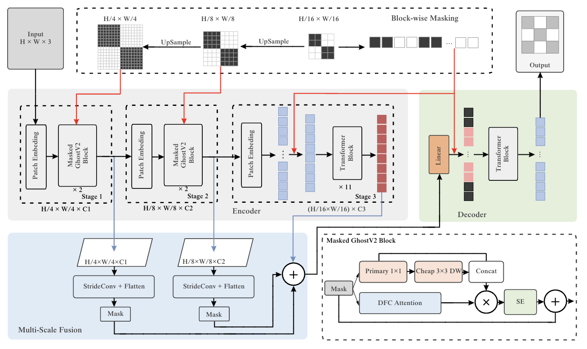

# Inference-Efficient ConvMAE for Visual Recognition

Research code for the FPT University capstone project **“Inference-Efficient ConvMAE for
Universal Visual Recognition Tasks”** (group GSU26AI07, project SU26AI45). We study how far a
[ConvMAE / MCMAE](https://arxiv.org/abs/2205.03892) backbone can be made **lighter and more
deployment-friendly** without sacrificing representation quality, under a single, strictly
controlled fair-comparison protocol.

> **TL;DR.** We compare a Ghost-based early stage against three high-level Stage-3 designs
> (Transformer, ForwardMamba, Bidirectional Mamba), all pre-trained 300 epochs on ImageNet-1K
> and evaluated with one recipe. The **Ghost + ConvMAE** arm (Ghost Stages 1–2 + 11 Transformer
> blocks) is selected as the deployable backbone. The central methodological finding is that
> **theoretical and realized efficiency diverge** — parameter count and asymptotic complexity do
> not predict throughput, memory, or deployability, so efficiency must be reported as a vector of
> separately-measured quantities and per inference pipeline.

<p align="center"></p>
<p align="center"><em>MCMAE encoder–decoder pipeline with block-wise masking, multi-scale fusion,
and the Masked GhostV2 block (inset).</em></p>

## The four arms

A single hierarchical ConvViT trunk is shared across all arms — patch sizes `[4, 2, 2]` →
`56×56 / 28×28 / 14×14`, embed dims `[256, 384, 768]`, depths `[2, 2, 11]`, 12 heads, decoder
`512-d / 8-block / 16-head`, mask ratio `0.75`. The **only** structural variable is the block
type at Stages 1–2 and Stage 3.

| Arm | Stages 1–2 | Stage 3 | Inference params |
|---|---|---|---|
| Baseline (ConvMAE-Base) | CBlock (masked depthwise conv) | Transformer × 11 | 85.4 M |
| **Ghost + ConvMAE** *(selected)* | GhostNetV2 block | Transformer × 11 | **81.9 M (−4%)** |
| Ghost + ForwardMamba | GhostNetV2 block | Mamba-2 × 7 + Transformer × 4 `{3,7,9,10}` | 63.5 M (−26%) |
| Ghost + BiMamba | GhostNetV2 block | Bi-Mamba-2 × 7 + Transformer × 4 `{3,7,9,10}` | 89.2 M |

Two targeted refinements to the state-space stage are studied as isolated ablations: **S1**
Windowed Local Scan (2-D locality) and **S2** ConvFFN (channel-spatial mixing).

## Key results (measured)

**Representation quality — ImageNet-1K linear probing (300-epoch pre-training, frozen backbone):**

| Arm | Top-1 (%) |
|---|---|
| ConvMAE-Base | 64.06 |
| Ghost + ConvMAE | 58.60 (−5.5 pt, recovered by fine-tuning) |
| Ghost + BiMamba | 56.90 |
| Ghost + ForwardMamba | 55.30 |

**Inference throughput — bias-controlled RTX A5000, batch 32 (img/s):**

| Arm | PyTorch FP32 | PyTorch FP16 | TensorRT FP32 | TensorRT FP16 |
|---|---|---|---|---|
| ConvMAE-Base | 186.3 | 738.1 | 456.3 | 1045.7 |
| Ghost + ConvMAE | 224.0 | 612.4 | 599.8 | 1330.9 |
| Ghost + ForwardMamba | 196.3 | 436.3 | — | — |
| Ghost + BiMamba | 134.5 | 290.2 | — | — |

A **precision-dependent crossover**: Ghost is faster in compute-bound FP32 but slower under FP16
Tensor-Core execution; under full TensorRT the selected Ghost arm is faster *and* lighter than
Base at both precisions. The state-space arms produce no clean TensorRT engine under the tested
ONNX export path (no standard selective-scan operator) — a toolchain limitation, not an inherent
architectural one.

**Downstream face fine-tuning (mean over 3 seeds):** CASIA-WebFace Top-1 91.49 vs 91.32 (≈ equal);
CelebA mAP 0.789 vs 0.778; LFW AUC 0.9921 vs 0.9833; SCface Top-1 45.13 vs 31.36 (the
low-resolution stressor, where cheap half-generated feature maps cost most). **S1** adds +1.22
Top-1 at zero memory cost; **S2** adds +2.82 Top-1 at +16.8% memory.

## Repository layout

```
model_convmae_{baseline,allghost,bimamba,forwardmamba}.py   architecture factories (four arms)
model_convmae_cls_{baseline,ghost,bimamba,forwardmamba}.py  linear-probe / CLS classifier factories (encoder + head)
blocks_ghost.py  blocks_mamba_{forward,bidir}.py            Stage-1/2 Ghost + Stage-3 Mamba blocks
conv_ffn.py  local_scan.py                                  S2 ConvFFN, S1 windowed local scan
models_convvit.py  vision_transformer.py                    shared ConvViT trunk
finetune/common/                                            single-source fair-comparison recipe + engine
  config.py                                                 the ONE source of truth for the recipe
finetune/configs/                                           per-dataset task specs (casia/celeba/lfw/scface)
scripts/                                                    bias-controlled benchmarks + dataset prep
figures/                                                    paper figures
```

## Reproduce

```bash
pip install torch torchvision timm==0.9.16    # + a CUDA build for GPU runs (see the demo repo below)

# CPU smoke of every arm × task (synthetic data)
python scripts/make_synthetic_data.py
# fair-comparison fine-tune (identical recipe across arms; each arm from its own 300-ep checkpoint)
python finetune/common/train.py --dataset casia --model ghost --data_path data/casia
# bias-controlled inference benchmark (Table VI-4a): cuDNN autotune, warm-up 30, median of 3×100
python scripts/gpu_bench_v2.py
```

`finetune/common/config.py` is the single source of truth for the recipe (effective batch 1,024,
`blr 5e-4`, layer decay 0.65, weight decay 0.05, drop-path 0.1, BF16); checkpoint loading asserts
that exactly the freshly-initialized head + normalization parameters are missing, failing fast on
any architectural drift. ImageNet-1K and the face datasets are **not** redistributed — see the
`scripts/prepare_*.py` helpers.

## Deploy the linear-probe classifiers

`scripts/demo_deploy_infer.py` runs any of the four arms' ImageNet-1K linear-probe classifiers
(frozen 300-ep backbone + `BatchNorm1d → Linear` head) through the report's inference pipelines and
classifies real images:

```bash
# baseline / ghost -> native PyTorch AND full TensorRT (ONNX export -> engine)
python scripts/demo_deploy_infer.py --arm ghost --checkpoint <ghost_linprobe.pth> \
    --images <imagenet>/val/n01440764 --pipeline auto --precision fp16
# bimamba / forwardmamba -> native PyTorch only (selective scan has no ONNX/TensorRT path)
python scripts/demo_deploy_infer.py --arm bimamba --checkpoint <bimamba_linprobe.pth> \
    --images <imagenet>/val/n01440764 --pipeline pytorch
```

The `model_convmae_cls_*` factories build the classifiers; the Mamba arms additionally require
`mamba_ssm` (CUDA). Set `IMAGENET_CLASS_INDEX=/path/to/imagenet_class_index.json` for readable labels.

## Demo

A self-contained laptop demo compares the two fine-tuned backbones side by side on four
face tasks, runs through **PyTorch or a TensorRT engine** (selectable in the UI), and reports a
**live peak-VRAM measurement** next to the paper's A5000 reference. The demo lives in its own
repository: **[QuangCler/ghostconvmae-face-demo](https://github.com/QuangCler/ghostconvmae-face-demo)**
(private; access on request).

## Citation

If you use this code, please cite the capstone report (see `CITATION.cff`).

## License

Code released under the [MIT License](LICENSE). Datasets and pre-trained checkpoints are **not**
included and remain under their respective licences. Face datasets (e.g. SCface) are used strictly
under their research licences; no personal data is redistributed.

## Acknowledgements

Built on [MCMAE/ConvMAE](https://github.com/Alpha-VL/ConvMAE), [GhostNet/GhostNetV2](https://github.com/huawei-noah/Efficient-AI-Backbones),
[Mamba](https://github.com/state-spaces/mamba), [Vim](https://github.com/hustvl/Vim),
[LocalMamba](https://github.com/hunto/LocalMamba), and [timm](https://github.com/huggingface/pytorch-image-models).
